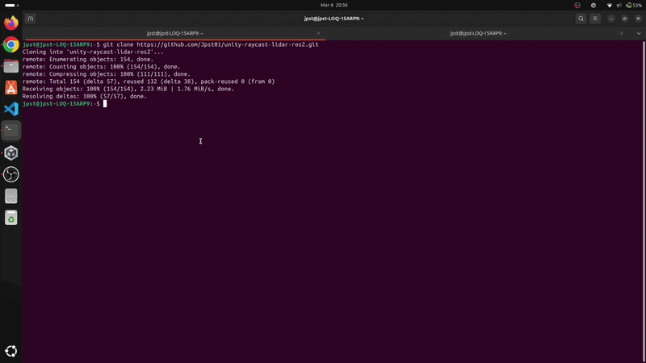
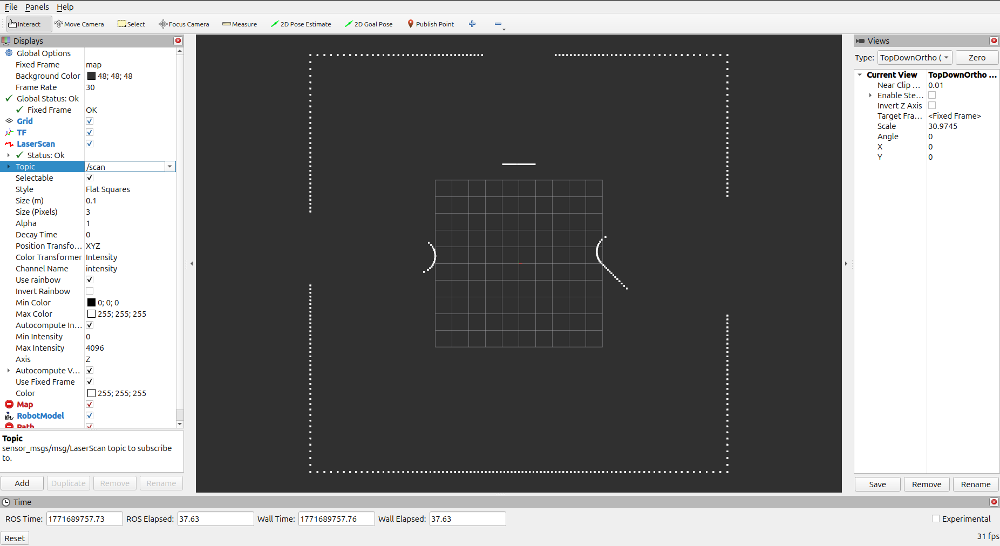
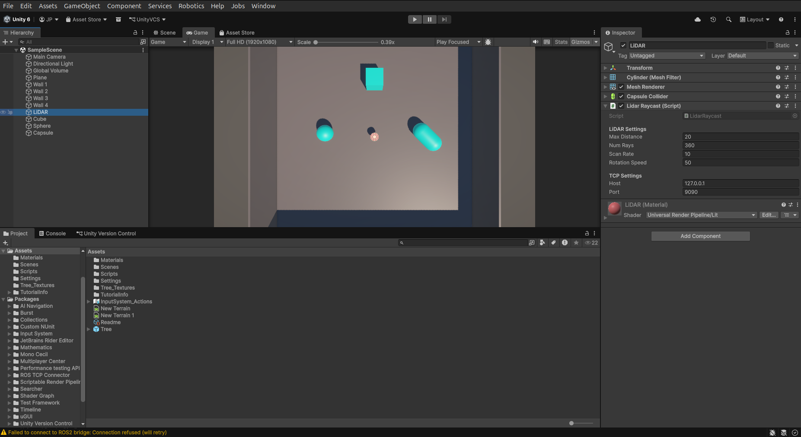

# Raycast-Based LiDAR Simulation in Unity with ROS2 (Jazzy)

## Overview
This project implements a 2D LiDAR simulation using Unity's Raycast system with **keyboard-controlled movement**. The LiDAR can be moved around 3D objects in the scene, and the scan data is published to ROS2 (Jazzy) for real-time visualization in RViz.

A custom ROS2 bridge (`unity_lidar_bridge`) receives LiDAR data from Unity over TCP, publishes `sensor_msgs/msg/LaserScan` on `/scan`, and broadcasts a **dynamic TF** (`map → lidar_frame`) so RViz tracks the LiDAR's live position.


---

## Demo

*Click gif to watch full video*  

[](https://youtu.be/FB7uEyiEj2c)
---

## Features
- 360° LiDAR simulation using Unity Raycasts
- **WASD keyboard-controlled movement**
- Custom TCP-based bridge between Unity and ROS2
- ROS2 LaserScan publishing on `/scan` topic
- **Dynamic TF broadcasting** (`map → lidar_frame`) — LiDAR position updates in real-time
- Visualization in RViz — objects stay stationary, only LiDAR moves 

---

## System Architecture

```
Unity (Raycast LiDAR + Keyboard Movement)
→ TCP Socket (JSON: scan data + position)
→ ROS2 Bridge (unity_lidar_bridge)
→ /scan (LaserScan) + /tf (Dynamic Transform)
→ RViz Visualization  
```

---  

## Controls

| Key | Action |
|-----|--------|
| **W** | Move forward |
| **S** | Move backward |
| **A** | Move left |
| **D** | Move right |


> **Note:** You must be in the Unity **Game** view before using keyboard controls.

---
  
## Project Structure

### Unity Project
- `Assets/` – Scripts and scene  
- `Packages/` – Unity dependencies  
- `ProjectSettings/` – Project configuration  

### ROS2 Package: `unity_lidar_bridge`
- `lidar_bridge_node.py` – TCP server + LaserScan publisher  
- `lidar_bridge_launch.py` – Launch file (bridge + static TF)  
- `package.xml`, `setup.py`, `setup.cfg` – ROS2 package setup  

---

## Requirements

### Software
- Unity
- ROS2 Jazzy
- Python 3
- RViz2

## How to Run

### 1. Start ROS2 Bridge (Terminal 1)

Open a terminal and run:

```bash
cd ~
mkdir -p unity_lidar_ws/src
mv ~/unity-raycast-lidar-ros2/unity_lidar_bridge ~/unity_lidar_ws/src/
cd ~/unity_lidar_ws
colcon build
```

```bash
source /opt/ros/jazzy/setup.bash
source install/setup.bash
ros2 launch unity_lidar_bridge lidar_bridge_launch.py
```

### 2. Run Unity Simulation
- Open project in Unity (opening project first time may take longer)
- Press Play
- The LiDAR data will start streaming to ROS2
- You must be in the **Game** view to use keyboard controls
- Use **WASD** to move the LiDAR around objects

#### Note
If you dont see any objects in the project then you may need to go to File &rarr; Open Scene &rarr; Select file **SampleScene.unity** at 
```
~/unity-raycast-lidar-ros2/Assets/Scenes/SampleScene.unity
```

### 3. Visualize in RViz2 (Terminal 2)
```bash
source /opt/ros/jazzy/setup.bash
rviz2
```
- Once RViz is loaded, expand ```LaserScan``` and double click on the white space in front of ```topic``` and select ```/scan```
- You can increase the size of points by increasing value in front of ```size (m)```  
  

## Configuration & Parameters

You can change the Range, Number of Rays, Scan Rate and Rotation Speed of LiDAR in Unity by following the below steps:  
   1. Click **LiDAR** in Hierarchy panel on left side
   2. On Right Side you can find parameter like Max Distance, Number of Rays, Scan Rate and Rotation Speed in **Lidar Raycast (Script)** component  
  